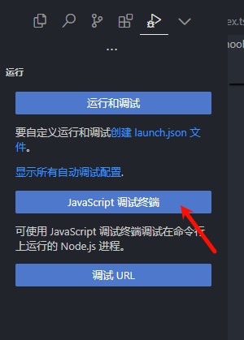

# vue单元测试

## 安装

1. 安装依赖

```bash
npm i -D vitest jsdom @testing-library/vue
```

2. 配置config

```js
import { defineConfig } from 'vite'
export default defineConfig({
  // ...
  test: {
    // 启用类似 jest 的全局测试 API
    globals: true,
    // 使用 jsdom 模拟 DOM
    environment: 'jsdom'
  }
})
```

3. 配置tsconfig

```json
// tsconfig.json

{
  "compilerOptions": {
    "types": ["vitest/globals"]
  }
}
```

4. 添加scripts

```json
{
  // ...
  "scripts": {
    "test": "vitest"
  }
}
```

配置完成之后在项目目录添加 `*.test.ts` 文件，运行 `pnpm test`就会测试了

## 常用函数

> 更多常用函数参考：
>
> vitest：https://cn.vitest.dev/api/expect.html
>
> jest：https://jestjs.io/zh-Hans/docs/expect

### describe

一个测试块，所有的测试需要写在describe块内

```js
describe('这里是描述信息', () => {
    it('这里是单个测试的描述信息', () => {
        // 这里写测试用例
    })
})
```

### beforeEach

在所有的单测之前运行

```js
describe('test', () => {
    beforeEach(() => {
        const store = { name: '123' }
    })
    it('demo', () => {
        // 这里能拿到store
    })
})
```


### toBe

校验基本数据类型是否相等

```js
expect(result.loading).toBe(false)
```


### toEqual

校验对象是否相等

```js
expect(result.data).toEqual(data)
```


### toHaveLength

判断数组的长度为多少

```js
expect(data).toHaveLength(1)
```


### toHaveBeenCalledWith

校验上一次调用函数的参数是什么

```js
expect(http).toHaveBeenCalledWith({
  url: '/api/test',
  method: 'get',
})
```


### resolves

校验promise的返回值

```js
expect(result.refetch()).resolves.toEqual(defaultData)
```


### rejects

校验promise抛出错误是否相等

```js
expect(result.refetch()).rejects.toThrow('缺少必要参数')
```


### flushPromises

等待请求完成

```js
import { flushPromises } from '@vue/test-utils'

const result = await fetch()
await flushPromises()
```


## 测试hooks

1. 添加`test-utils.ts`

```ts
import { createApp } from 'vue'

export function withSetup(composable) {
  let result
  const app = createApp({
    setup() {
      result = composable()

      // 忽略模板警告
      return () => {}
    }
  })
  app.mount(document.createElement('div'))

  // 返回结果与应用实例
  // 用来测试供给和组件卸载
  return [result, app]
}
```

2. 简单的useFetch单测

```ts
import { describe, it, expect, vi, beforeEach } from 'vitest'
import http from '@/api/axios'

const defaultData = {
  success: true,
  status: 200,
  statusText: 'OK',
  headers: {},
  config: {},
  data: { list: [] }
}

// Mock axios和ElMessage
vi.mock('@/api/axios', () => ({
  // 模拟默认返回的函数
  default: vi.fn(() => Promise.resolve(defaultData)),
}))

describe('useRequest', () => {
  it('基本POST请求', async () => {
    // 测试hooks，会模拟jsdom环境
    const [result, app] = withSetup(() => 
      useRequest('/api/test/:id', {
        method: 'post',
        params: { id: 1, test: 'success' },
      })
    )

    // 检查初始的loading状态
    expect(result.loading.value).toBe(false)

    // 发起请求，并校验
    expect(result.refetch()).resolves.toEqual(defaultData)

    // 等待vue更新
    await nextTick()

    // 检查loading请求中状态
    expect(result.loading.value).toBe(true)

    // 检查http请求的参数
    expect(http).toHaveBeenCalledWith({
      url: '/api/test/1',
      method: 'post',
      data: { test: 'success' },
    })

    // 等待请求完成
    await flushPromises()

    // 检查loading请求完成状态
    expect(result.loading.value).toBe(false)

    // 卸载组件，完成测试
    app.unmount()
  })
})
```

## 测试pinia

```js
import { describe, it, expect, beforeEach } from 'vitest'
import { createPinia, setActivePinia } from 'pinia'
import login from '@/store/login'

describe('useStore', () => {
    beforeEach(() => {
        setActivePinia(createPinia())
        const store = login()
        store.token = 'aaaaaaaaa'
    })
    
    it('test token', () => {
        const store = login()
        expect(store.token).toBe('aaaaaaaaa')
    })
})
```


## 测试调试

1. 进入调试终端



2. 在对应的行 点击小红点，之后直接运行 `pnpm test` 即可进入断点


